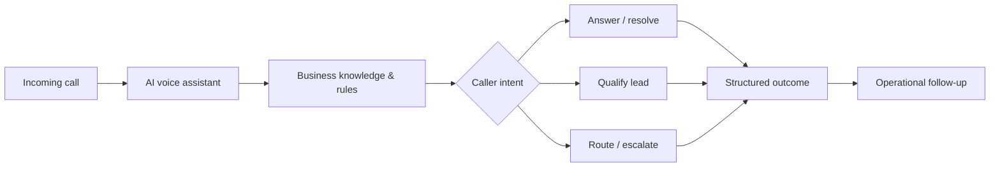

# CallPilot AI

**AI phone assistant for Swiss SMEs.**

CallPilot helps small and medium-sized businesses stay reachable when their team cannot answer every call. The product uses AI voice automation to handle incoming calls, understand intent and support structured follow-up workflows.

[Visit CallPilot](https://callpilot.ch)

## The problem

Missed calls often mean missed opportunities. For many SMEs, reception coverage is limited outside office hours, during busy periods or while staff are serving customers.

## The product

CallPilot provides an AI phone assistant designed for practical business use:

- answers incoming calls around the clock
- understands caller intent and business-specific context
- supports lead qualification and structured follow-up
- routes or escalates conversations when human handling is needed
- works across multilingual customer interactions
- connects voice interactions with operational workflows

## Product approach

CallPilot is built as a production product rather than a standalone voice demo. The public experience, voice layer, business logic, analytics and operational tooling are designed as one system.

The diagram is intentionally simplified and shows the public product concept rather than proprietary implementation details.

## Product principles

**Useful before impressive**  
The assistant is designed around real call handling and business outcomes, not generic AI demonstrations.

**Swiss business context**  
The product is positioned for Swiss SMEs, with multilingual capability and a strong focus on trust and operational fit.

**Human escalation remains part of the system**  
Automation is used where it helps; conversations can still be routed into human workflows when required.

**Measure and improve**  
Voice interactions feed structured operational signals so the product and customer workflows can be continuously improved.

## What this project demonstrates

This case study represents work across:

`Voice AI` · `AI product design` · `SaaS` · `workflow automation` · `React` · `TypeScript` · `production operations`

## About this repository

This is a **public product showcase**, not the production source repository.

The CallPilot application source code, infrastructure configuration, internal documentation, customer data and proprietary implementation details remain private. This repository documents the product, product thinking and a deliberately simplified implementation approach.

---

**Product:** [callpilot.ch](https://callpilot.ch)  
**Builder:** [Raphael Scalise](https://github.com/scali790)
